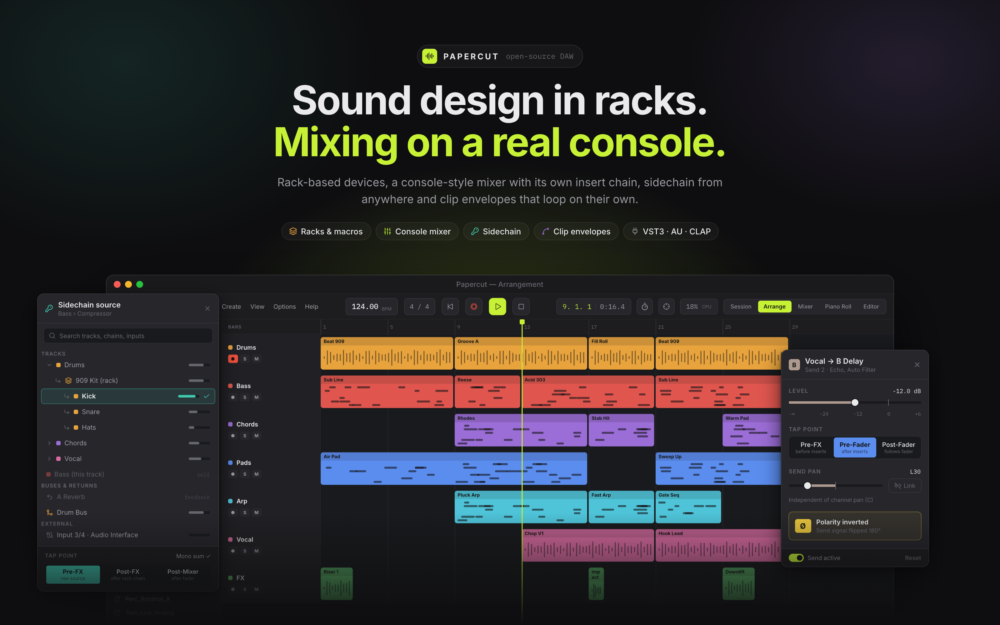
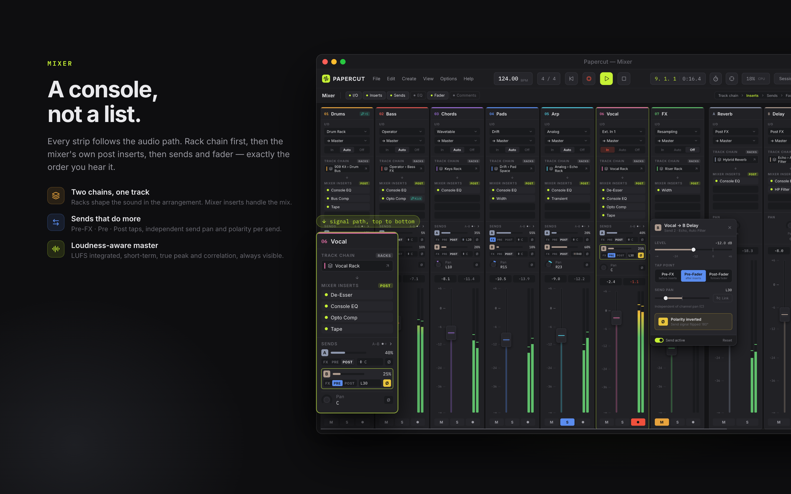
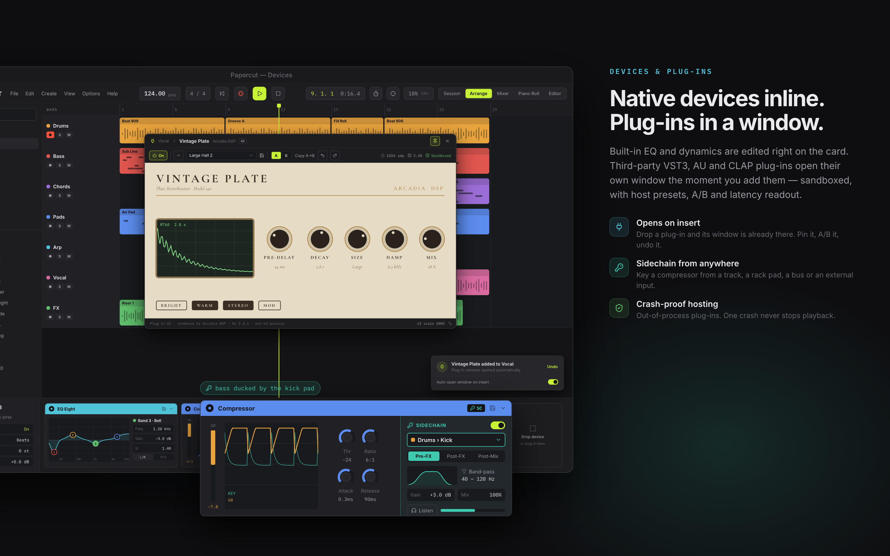
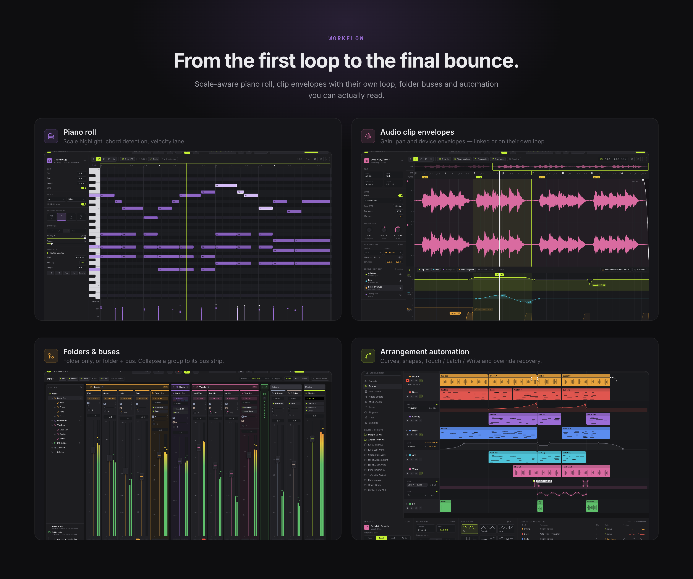

# Resamper

**English** · [Türkçe](#türkçe)

[](https://github.com/leizzo/resamper/actions/workflows/release.yml)
[](https://github.com/leizzo/resamper/actions/workflows/commits.yml)
[](https://github.com/leizzo/resamper/releases)

<p align="center">
  
</p>

A dark, dense, keyboard-friendly desktop DAW for electronic producers and mix engineers.

> **Status: alpha.** Resamper is in early development. The current release is
> [v0.1.2 — M1 Core](https://github.com/leizzo/resamper/releases/tag/v0.1.2), published as an alpha
> pre-release. Expect missing features, rough edges and project-format changes — don't trust it with
> your only copy of a song yet.

## What is Resamper?

Resamper takes you from idea to structure to mix in a single window. Its core principle:
**sound design lives in the device chain, mixing lives in the mixer** — two separate chains, with a
signal path you can always see.

## Design preview

> These images come from the product design ([`design/design.pen`](design/design.pen)) and show
> where Resamper is heading. Several features in them belong to later milestones — see the
> [roadmap](#roadmap) for what's in v0.1.2 today.

### A console, not a list



### Native devices inline. Plug-ins in a window.



### From the first loop to the final bounce



## What you can do today (v0.1.2)

- **Arrange** — audio and MIDI tracks, clips you can move, resize, split, duplicate, loop-extend and
  consolidate; zoom, lane height and Follow.
- **Record** — audio recording with input selection, live waveform and takes; MIDI recording from a
  MIDI input; count-in (Shift-click Rec to skip it).
- **Edit MIDI** — piano roll note editing and quantize.
- **Shape sound** — a per-track device chain with plug-ins, shown in the detail view.
- **Mix** — volume, pan, mute, solo, stereo meters, 8 insert slots per channel with bypass and reorder;
  Bus Strips with their own inserts and Sends.
- **Browse** — a library browser with search, categories, sample preview and drag-to-track.
- **Stay safe** — autosave and crash recovery.

See [CHANGELOG.md](CHANGELOG.md) for the full list.

## Roadmap

| Milestone | What it brings |
|---|---|
| **M1 — Core** ✅ | Shell, transport, Arrangement, device chain with plug-ins, basic Mixer, design system (v0.1.0) |
| **M1.1 — Devices & Plug-ins** | Native devices (EQ Eight, Compressor), VST3 / AU / CLAP hosting with crash isolation, plug-in window on insert |
| **M2 — Mix** | Pre-FX / Pre / Post sends, returns, master loudness, folders & buses, sidechain inputs |
| **M3 — Automation** | Arrangement lanes, clip overlays, Read / Touch / Latch / Write |
| **M4 — Editors** | Scale-aware piano roll with chords and velocity, audio editor with warp and fades, clip envelopes |
| **M5 — Racks & Session** | Instrument / Drum / Audio Effect racks, macros, Session view with scenes, crossfader |

Target platforms: macOS 13+ (Apple Silicon) and Windows 11 x64. The alpha currently builds on macOS.

## Getting started

Download `Resamper-<version>-macOS.dmg` (Apple Silicon) from
[Releases](https://github.com/leizzo/resamper/releases), open it and drag Resamper to Applications. Or
build from source (see [For developers](#for-developers)).

### Keyboard shortcuts

`Mod` = Cmd on macOS, Ctrl on Windows.

| Action | Shortcut |
|---|---|
| Play / Stop · Play from selection | `Space` · `Shift+Space` |
| Record | `F9` (count-in; Shift-click Rec to skip) |
| Loop selection · Return to start | `Mod+L` · `Home` |
| Metronome · Tap tempo | `C` · `T` |
| Session ↔ Arrange · Mixer | `Tab` · `Mod+Alt+M` |
| Toggle detail view · browser | `Mod+Alt+L` · `Mod+Alt+B` |
| Undo · Redo | `Mod+Z` · `Mod+Shift+Z` |
| Duplicate · Split · Consolidate | `Mod+D` · `Mod+E` · `Mod+J` |
| New audio · MIDI track · return | `Mod+T` · `Mod+Shift+T` · `Mod+Alt+T` |
| Mute track 1–8 · Solo selected | `F1`–`F8` · `S` |
| Zoom in / out · to selection · to song | `+` / `−` · `Z` · `Shift+Z` |
| Piano roll: quantize · transpose | `Q` · `↑↓` (semitone), `Shift+↑↓` (octave) |
| New · Open · Save project | `Mod+N` · `Mod+O` · `Mod+S` |
| Export mix | `Mod+Shift+E` |

## Feedback

Found a bug or have an idea? [Open an issue](https://github.com/leizzo/resamper/issues).

## License

Resamper's source code is released under the [MIT License](LICENSE).

---

<a id="türkçe"></a>

# Resamper (Türkçe)

[English](#resamper) · **Türkçe**

[](https://github.com/leizzo/resamper/actions/workflows/release.yml)
[](https://github.com/leizzo/resamper/actions/workflows/commits.yml)
[](https://github.com/leizzo/resamper/releases)

<p align="center">
  
</p>

Elektronik müzik prodüktörleri ve miks mühendisleri için koyu temalı, yoğun ve klavye dostu bir
masaüstü DAW.

> **Durum: alfa.** Resamper erken geliştirme aşamasında. Güncel sürüm
> [v0.1.2 — M1 Core](https://github.com/leizzo/resamper/releases/tag/v0.1.2), alfa ön sürümü olarak
> yayımlandı. Eksik özellikler, pürüzler ve proje formatında değişiklikler olabilir — şarkınızın tek
> kopyasını henüz ona emanet etmeyin.

## Resamper nedir?

Resamper, fikirden yapıya, yapıdan mikse tek bir pencerede ilerlemenizi sağlar. Temel ilkesi:
**ses tasarımı cihaz zincirinde, miks mikserde yapılır** — iki ayrı zincir ve her zaman görebildiğiniz
bir sinyal yolu.

## Tasarım önizlemesi

> Bu görseller ürün tasarımından ([`design/design.pen`](design/design.pen)) alınmıştır ve
> Resamper'ın nereye gittiğini gösterir. İçlerindeki bazı özellikler sonraki kilometre taşlarına
> aittir — v0.1.2'de bugün neler olduğunu görmek için [yol haritasına](#yol-haritası) bakın.

### Liste değil, konsol


### Yerleşik cihazlar kartta. Eklentiler kendi penceresinde.


### İlk döngüden son bounce'a


## Bugün neler yapabilirsiniz (v0.1.2)

- **Aranje** — ses ve MIDI kanalları; taşıyabildiğiniz, boyutlandırabildiğiniz, bölebildiğiniz,
  çoğaltabildiğiniz, döngüyle uzatabildiğiniz ve birleştirebildiğiniz klipler; zoom, kanal yüksekliği
  ve Follow.
- **Kayıt** — giriş seçimi, canlı dalga formu ve take'lerle ses kaydı; MIDI girişinden MIDI kaydı;
  count-in (atlamak için Rec'e Shift ile tıklayın).
- **MIDI düzenleme** — piano roll'da nota düzenleme ve quantize.
- **Ses tasarımı** — detay görünümünde, her kanal için eklentili cihaz zinciri.
- **Miks** — ses seviyesi, pan, mute, solo, stereo metreler; kanal başına bypass ve sıralama destekli
  8 insert slotu; kendi insert'leri ve Send'leri olan Bus kanalları.
- **Kütüphane** — arama, kategoriler, sample önizleme ve kanala sürükle-bırak içeren kütüphane tarayıcısı.
- **Güvenlik** — otomatik kayıt ve çökme sonrası kurtarma.

Tam liste için [CHANGELOG.md](CHANGELOG.md) dosyasına bakın.

## Yol haritası

| Kilometre taşı | Getirdikleri |
|---|---|
| **M1 — Core** ✅ | Kabuk, transport, Arrangement, eklentili cihaz zinciri, temel Mixer, tasarım sistemi (v0.1.0) |
| **M1.1 — Cihazlar ve Eklentiler** | Yerleşik cihazlar (EQ Eight, Compressor), çökme izolasyonlu VST3 / AU / CLAP desteği, eklenince açılan eklenti penceresi |
| **M2 — Miks** | Pre-FX / Pre / Post send'ler, return kanalları, master loudness, klasörler ve bus'lar, sidechain girişleri |
| **M3 — Otomasyon** | Arrangement otomasyon şeritleri, klip üzeri zarflar, Read / Touch / Latch / Write |
| **M4 — Editörler** | Gam ve akor destekli, velocity şeritli piano roll; warp ve fade destekli ses editörü; klip zarfları |
| **M5 — Rack'ler ve Session** | Instrument / Drum / Audio Effect rack'leri, makrolar, sahneli Session görünümü, crossfader |

Hedef platformlar: macOS 13+ (Apple Silicon) ve Windows 11 x64. Alfa sürümü şu an macOS'ta derleniyor.

## Başlarken

[Releases](https://github.com/leizzo/resamper/releases) sayfasından `Resamper-<sürüm>-macOS.dmg`
dosyasını (Apple Silicon) indirip açın ve Resamper'ı Applications'a sürükleyin. Ya da kaynaktan derleyin
([Geliştiriciler için](#for-developers) bölümüne bakın).

### Klavye kısayolları

`Mod` = macOS'ta Cmd, Windows'ta Ctrl.

| İşlem | Kısayol |
|---|---|
| Çal / Durdur · Seçimden çal | `Space` · `Shift+Space` |
| Kayıt | `F9` (count-in ile; atlamak için Rec'e Shift ile tıklayın) |
| Seçimi döngüye al · Başa dön | `Mod+L` · `Home` |
| Metronom · Tap tempo | `C` · `T` |
| Session ↔ Arrange · Mixer | `Tab` · `Mod+Alt+M` |
| Detay görünümü · tarayıcıyı aç/kapa | `Mod+Alt+L` · `Mod+Alt+B` |
| Geri al · Yinele | `Mod+Z` · `Mod+Shift+Z` |
| Çoğalt · Böl · Birleştir | `Mod+D` · `Mod+E` · `Mod+J` |
| Yeni ses · MIDI kanalı · return | `Mod+T` · `Mod+Shift+T` · `Mod+Alt+T` |
| 1–8. kanalı sustur · Seçiliyi solo | `F1`–`F8` · `S` |
| Yakınlaş / uzaklaş · seçime · şarkıya | `+` / `−` · `Z` · `Shift+Z` |
| Piano roll: quantize · transpoze | `Q` · `↑↓` (yarım ses), `Shift+↑↓` (oktav) |
| Yeni · Aç · Projeyi kaydet | `Mod+N` · `Mod+O` · `Mod+S` |
| Miksi dışa aktar | `Mod+Shift+E` |

## Geri bildirim

Bir hata mı buldunuz ya da bir fikriniz mi var? [Issue açın](https://github.com/leizzo/resamper/issues).

## Lisans

Resamper'ın kaynak kodu [MIT Lisansı](LICENSE) ile yayımlanmıştır.

---

<a id="for-developers"></a>

# For developers · Geliştiriciler için

*Teknik bölüm, komut ve kod terimleri ortak olduğu için İngilizce tutulmuştur.*

Resamper is built on [JUCE](https://juce.com) + [Tracktion Engine](https://github.com/Tracktion/tracktion_engine)
+ [GIN](https://github.com/FigBug/Gin). [PRD.md](PRD.md) is the source of truth for product behaviour;
[CONTEXT.md](CONTEXT.md) defines the domain language.

## Dependencies (pinned git submodules)

| Path | Pin |
|---|---|
| `external/tracktion_engine` | Tracktion Engine 3.5.0, commit `964583ee` (3.5.0 plus an upstream fix for a null ProjectItem crash when saving an Edit outside a Tracktion project) |
| `external/tracktion_engine/modules/juce` | JUCE 8.0.13 (`8.0.13-7-g37c894f8`), pinned by Tracktion |
| `external/gin` | GIN, commit `ea795541`; only the `gin` module is built (other modules are added when code needs them) |

## Build (macOS)

Requires CMake ≥ 3.22, Ninja and Xcode command-line tools (C++20).

```sh
git submodule update --init external/gin external/tracktion_engine
# Tracktion's .gitmodules points JUCE at an SSH URL; use HTTPS unless you have GitHub SSH keys:
git -C external/tracktion_engine config submodule.modules/juce.url https://github.com/juce-framework/JUCE.git
git -C external/tracktion_engine submodule update --init modules/juce

cmake -S . -B build -G Ninja -DCMAKE_BUILD_TYPE=Debug
cmake --build build
```

- App: `build/Resamper_artefacts/Debug/Resamper.app`
- Tests (headless, no audio device): `build/ResamperTests_artefacts/Debug/ResamperTests [suite-name-filter]`, or `ctest --test-dir build`

## Layout

```
Source/Engine/    EngineManager, ProjectManager, ApplicationModel facade — the only code that sees Tracktion
Source/Commands/  Command registry, model Commands, ApplicationCommand ↔ Command ID table
Source/UI/        Theme, JSON layouts (ComponentFactory/LayoutManager), UI State, Arrangement, MainWindow
Source/App/       Application entry point
UI/layouts, UI/themes   Declarative UI files (embedded in Release; read from the source tree in Debug)
Tests/            Headless tests over the Command registry / Application Model seam
```

`Source/UI`, `Source/Commands` and `Source/App` are compiled without Tracktion on the include path, so
"UI never includes Tracktion headers" is a compile error rather than a convention.

## Developer Mode

In Debug builds, layouts and theme are read from `UI/` in the source tree. Edit a file, then:

- **Reload Layout** — Cmd+Alt+Shift+L: rebuilds only the regions whose layout file changed
- **Reload Theme** — Cmd+Alt+Shift+T: re-styles in place
- **Developer Overlay** — Cmd+Alt+Shift+D: shows the status bar and component inspector (hidden by default; the design has neither)

## Contributing

Issues are tracked on [GitHub](https://github.com/leizzo/resamper/issues). Releases follow
[Semantic Versioning](https://semver.org); each PRD milestone ships as a minor release until 1.0.0 —
see [CHANGELOG.md](CHANGELOG.md).

Commit subjects are `<gitmoji> <type>(<scope>): <summary>`, e.g. `🐛 fix(undo): …`; CI checks every
commit a pull request adds. Release notes group commits by `<type>`.

### Releasing

1. Bump `project(Resamper VERSION …)` in `CMakeLists.txt`, move `[Unreleased]` in `CHANGELOG.md` to a
   dated `[x.y.z]` section with its compare link, and commit `🔖 chore(release): vx.y.z`.
2. Tag it with a title and push: `git tag -a vx.y.z -m "vx.y.z — <title>" && git push origin main vx.y.z`.

The [Release workflow](.github/workflows/release.yml) checks the tag against the CMake version, builds
and tests the app, and publishes the release: the CHANGELOG section, the app signed and notarized in a
DMG, and the commit list from [git-cliff](https://git-cliff.org) (`cliff.toml`; preview it with
`git cliff --latest`). Tags are plain `vX.Y.Z`; 0.x releases are published as alpha pre-releases.

## License

Resamper's own code is [MIT](LICENSE). The pinned dependencies keep their own licenses: JUCE (AGPLv3 or
commercial), Tracktion Engine (GPLv3 or commercial) and GIN (BSD-3-Clause). A distributed Resamper
binary must also satisfy those terms.
